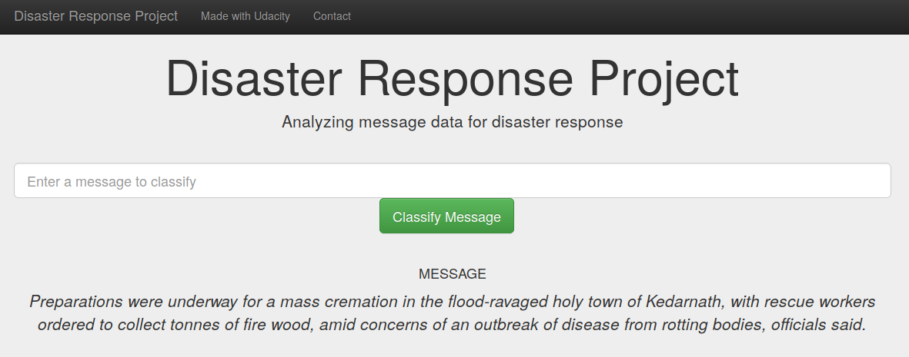
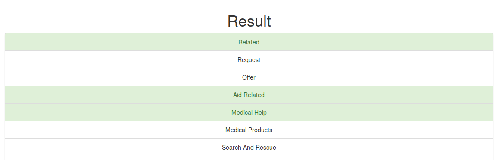
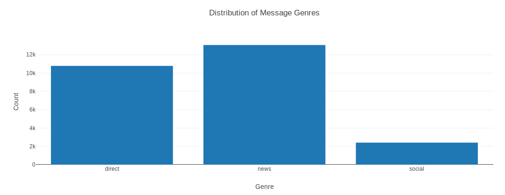
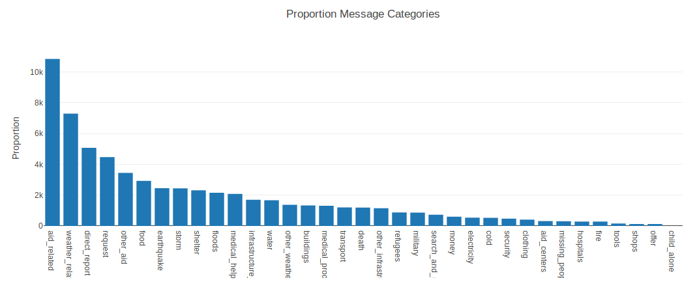
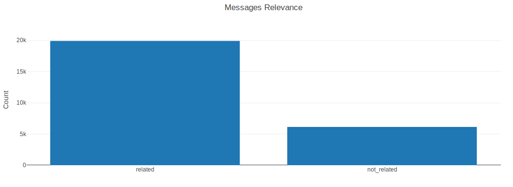

# Project: Disaster Response Project

### Table of Contents

1. [Installation](#installation)
2. [Project Motivation](#motivation)
3. [File Descriptions](#files)
4. [Results](#results)
5. [Licensing, Authors, and Acknowledgements](#licensing)

## Installation <a name="installation"></a>

This project requires **Python 3** and the following Python libraries installed:

- [NumPy](http://www.numpy.org/)
- [Pandas](http://pandas.pydata.org/)
- [sqlalchemy](https://docs.sqlalchemy.org/en/13/intro.html)
- [nltk](https://pypi.org/project/nltk/)
- [scikit-learn](http://scikit-learn.org/stable/)
- [plotly](https://plot.ly/matplotlib/getting-started/)
- [flask](http://flask.pocoo.org/docs/1.0/installation/)

## Project Motivation<a name="motivation"></a>

This project is a part of Udacity's Data Scientist Nanodegree. In this project we used the data provided by [Figure Eight](https://www.figure-eight.com/) to build a model for an application to classify the relevance of the messages among 36 defined categories. The dataset contain real messages that were sent during disaster events. 

Steps followed:
1. Created ETL pipeline for data cleansing and storing the clean data into a database table.
2. Created Machine Learning pipeline to extract the NLP features and optimized the model using grid search. So that the model can classify categories a message belongs to.
3. Created an app using Flash that can read the cleansed data and provide some interesting visualizations about the relevance of the messages.


## File Descriptions <a name="files"></a>

There are three major components of the application: 
1. process_data.py: This python script loads <messages>, <categories> datasets and merge them. Then cleans the data and stores it into a SQLite database.
2. train_classifer.py: This python script loads the cleansed data from SQLite database, builds a text processing and ML pipeline. Then 
trains and tunes the model using grid search. Then saves the model as pickle file.
3. run.py: This python script uses Flask to run the app. And show some visualizations on data using Plotly.


## Instructions:
**The datasets messages and categories are zipped into data_files.zip in folder named "data". You need to unzip these files and place them into the folder "data".**
1. Run the following commands in the project's root directory to set up your database and model.
    * To run ETL pipeline that cleans data and stores in database 
    ```
    python data/process_data.py data/messages.csv data/categories.csv data/Disaster_Response.db
    ```
    * To run ML pipeline that trains classifier and saves the model into as pickle file
    ```
    python models/train_classifier.py data/Disaster_Response.db models/model.pkl>
    ```

2. Run the following command in the app's directory to run your web app. 
    ```
    python run.py
    

    then Go to http://0.0.0.0:3001/
    ```

##Screenshots ##

Web app test example




The second screenshot shows Genre Proportions:


The third screenshot shows Message Proportion vs Categories:


The fourth screenshot shows number of realted messages vs not related messages:



## Licensing, Authors, Acknowledgements<a name="licensing"></a>

Must give credit to [Figure Eight](https://www.figure-eight.com/) for the data. 
